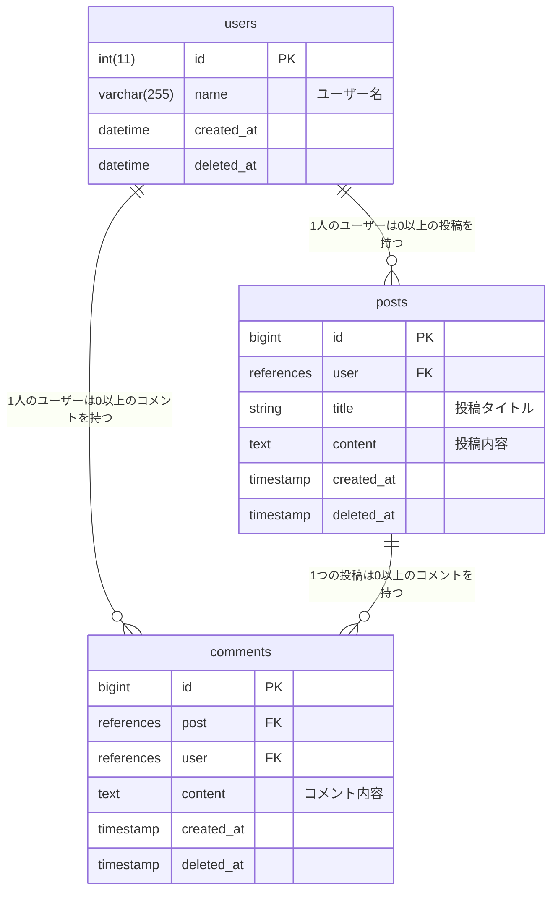

ここではmaermaid記法を色々と試してみます。

# ER図

```mermaid
erDiagram
  users ||--o{ posts : "1人のユーザーは0以上の投稿を持つ"
  users ||--o{ comments: "1人のユーザーは0以上のコメントを持つ"
  posts ||--o{ comments: "1つの投稿は0以上のコメントを持つ"

  users {
    int(11) id PK
    varchar(255) name "ユーザー名"
    datetime created_at
    datetime deleted_at
  }

  posts {
    bigint id PK
    references user FK
    string title "投稿タイトル"
    text content "投稿内容"
    timestamp created_at
    timestamp deleted_at
  }

  comments {
    bigint id PK
    references post FK
    references user FK
    text content "コメント内容"
    timestamp created_at
    timestamp deleted_at
  }
```